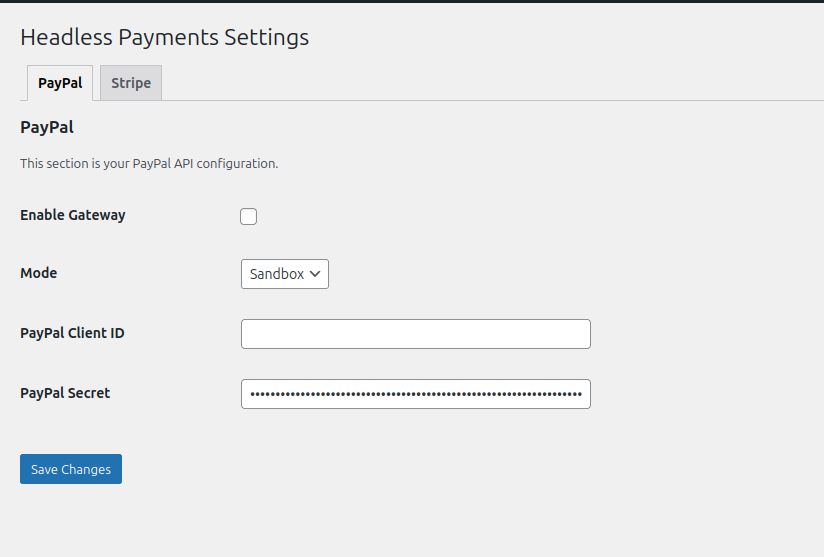
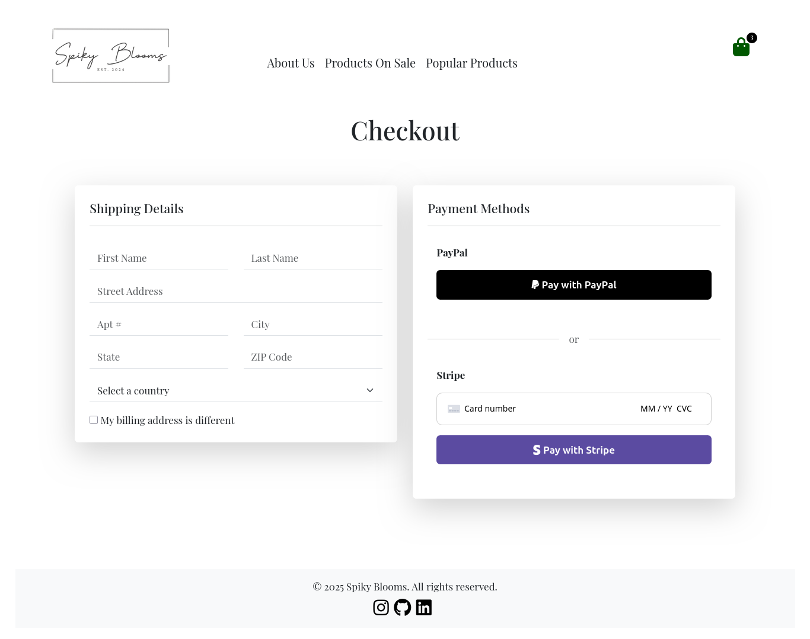

# 🧩 Headless Payments

**Headless Payments** is a free and open-source Wordpress plugin for handling payment flow via REST API designed to extend your custom checkout functionality in a **headless CMS architecture**.

Currently supporting **PayPal** and **Stripe**, this plugin offers customizable gateway settings and a frontend-agnostic design — making it ideal for JAMstack-style setups that use WordPress as a headless CMS.

Headless Payments leverages a clean and scalable OOP structure allowing you to customize your backend logic according to your requirements. 

One of the pain points in a headless CMS architecture is being limited from Woocommerce's core functionality. We strive to make payment integration less of a hassle allowing you to focus on things that matter the most.

---

## ✨ Features

- ✅ PayPal & Stripe integration (Sandbox + Live)
- ⚙️ Admin settings page with configurable credentials
- 🔘 Toggle gateways on/off via UI
- 🔌 Custom REST API endpoints for:
   - Creating PayPal orders
   - Capturing payments after approval
   - Creating Stripe payment intents
- 📦 Modular OOP structure (cleanly namespaced)
- 🔧 Ready for extension: Stripe, Square, etc.
- 💻 React/Vite compatible (but backend-agnostic)

---

## Admin Dashboard



## Custom Checkout



## ⚡ Frontend Frameworks Supported

- React JS
- Vue JS
- Next.js  
*(Or any framework of your choice — the API is frontend-agnostic)*

---

## 📦 Installation

1. **Requirements**
    - WordPress 6.x+
    - WooCommerce (optional, unless you're using it as the eCommerce backend)
    - PHP 7.4+
    - A headless frontend (React, Next.js, Vue, etc.)
    - Composer (for local development)
    - A custom-built checkout page

2. **Install the Plugin**
    - Clone this repository or download the ZIP
    - Place the plugin folder (`headless-payments`) inside your `/wp-content/plugins/` directory

3. **Activate the Plugin**
    - Log in to your WordPress dashboard
    - Go to **Plugins → Installed Plugins**
    - Activate **Headless Payments**

4. **Configure Payment Settings**
    - Navigate to **Headless Payments** in the WordPress admin sidebar
    - Under the tab of the gateway you intend to use (PayPal or Stripe), fill in your sandbox/live credentials

5. **Integrate with Frontend**
    - In `/src/Api/PayPalController.php`, API routes are defined in `register_routes()`
    - Use the following REST endpoints:
       - `POST /wp-json/hp/v1/paypal/create-order`
       - `POST /wp-json/hp/v1/paypal-capture-order`

    ### Sample Axios Integration (PayPal)

    ```js
    axios.post('http://your-website.com/wp-json/hp/v1/paypal/create-order', {
       amount: cartData.amount,
       currency: cartData.currency || 'USD'
    })
    .then(res => {
       const { approval_url } = res.data;
       if (approval_url) {
          setApprovalUrl(approval_url);
       } else {
          setError('Failed to get approval URL.');
       }
    })
    .catch(err => {
       console.error(err);
       setError('Failed to create PayPal order.');
    })
    .finally(() => setLoading(false));
    ```

6. **Integrate with Your Frontend**

    In the `/src/Api/PayPalController.php` file, API routes are declared in the `register_routes()` method.  
    Use the following REST API endpoints in your frontend app:

    - `POST /wp-json/hp/v1/paypal/create-order`
    - `POST /wp-json/hp/v1/paypal-capture-order`

    Here’s a sample React integration that shows how to:

    - Trigger PayPal order creation
    - Redirect the user to PayPal for approval
    - Bind the logic to a "Pay with PayPal" button

    ```jsx
    import axios from 'axios';
    import React, { useState } from 'react';

    const Checkout = ({ cartData }) => {
       const [approvalUrl, setApprovalUrl] = useState('');
       const [error, setError] = useState('');
       const [loading, setLoading] = useState(false);

       const handlePayNow = () => {
          setLoading(true);

          axios.post('http://your-website.com/wp-json/hp/v1/paypal/create-order', {
             amount: cartData.amount,
             currency: cartData.currency || 'USD'
          })
          .then(res => {
             const { approval_url } = res.data;
             if (approval_url) {
                setApprovalUrl(approval_url);
                window.location.href = approval_url; // Redirect user to PayPal
             } else {
                setError('Failed to get approval URL.');
             }
          })
          .catch(err => {
             console.error(err);
             setError('Failed to create PayPal order.');
          })
          .finally(() => setLoading(false));
       };

       return (
          <button onClick={handlePayNow} disabled={loading}>
             {loading ? 'Processing...' : 'Pay with PayPal'}
          </button>
       );
    };
    ```

---

### Stripe Integration

In the `/src/Api/StripeController.php` file, API routes are declared in the `register_routes()` method.  
Use the following REST API endpoint in your frontend app:

- `POST /wp-json/hp/v1/stripe/create-payment-intent`

Here’s a sample React integration using Stripe.js to:

- Create a Stripe PaymentIntent
- Use Stripe Elements to collect card info
- Confirm payment via the client secret

```jsx
import { loadStripe } from '@stripe/stripe-js';
import { Elements, CardElement, useStripe, useElements } from '@stripe/react-stripe-js';
import axios from 'axios';

const stripePromise = loadStripe('your-publishable-key');

const StripeCheckout = ({ amount }) => {
  const stripe = useStripe();
  const elements = useElements();

  const handleStripePayment = async () => {
    const card = elements.getElement(CardElement);
    const { data } = await axios.post('http://your-website.com/wp-json/hp/v1/stripe/create-payment-intent', {
      amount,
      currency: 'USD'
    });

    const { error, paymentIntent } = await stripe.confirmCardPayment(data.client_secret, {
      payment_method: {
        card,
        billing_details: { name: 'Jane Doe' }
      }
    });

    if (error) {
      console.error(error);
    } else if (paymentIntent.status === 'succeeded') {
      console.log('Payment successful!');
    }
  };

  return (
    <button onClick={handleStripePayment}>
      Pay with Stripe
    </button>
  );
};

// Wrap in <Elements stripe={stripePromise}> in your app
```
---

## 📝 Changelog

### [v0.2.0] - 2025-06-28

- ➕ Added Stripe integration (REST endpoint + admin settings)
- 🛠️ Refactored API route registration for multi-gateway extensibility
- 📚 Updated README documentation for Stripe usage

### [v0.1.0] - 2025-06-10

- 🎉 Initial release with PayPal support

## ⚠️ Disclaimer

This plugin is **experimental** and intended primarily for development, testing, and learning purposes.  
It has **not yet been tested in production environments**.

> Use at your own risk. We strongly recommend thorough testing in a staging environment before deploying to a live site.

We strive to improve stability, security, and extensibility — contributions, issues, and suggestions are welcome!

---
